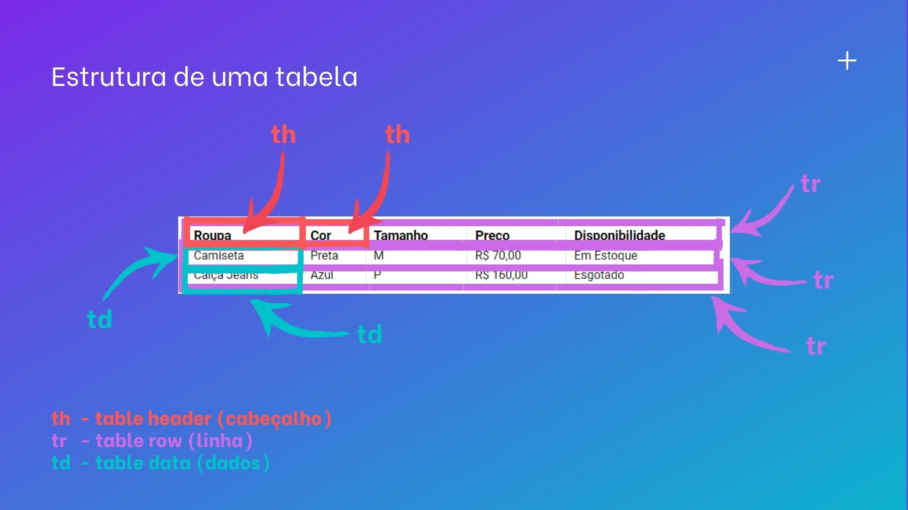

# Arquivo README de teste para estudos

Esse é um arquivo README.md criado com fins didáticos para o repositório remoto criado durante as aulas do módulo de Git e GitHub do curso DevQuest onde usamos um arquivo index.html do módulo de HTML Básico como exemplo para subí-lo ao GitHub.

[]

## Tecnologias Utilizadas

- HTML

## Como utilizar

1 - Clone o projeto
```
git clone <url>
```

2 - Acesse a oasta do projeto
```
cd aula-tabela-dev-quest
```